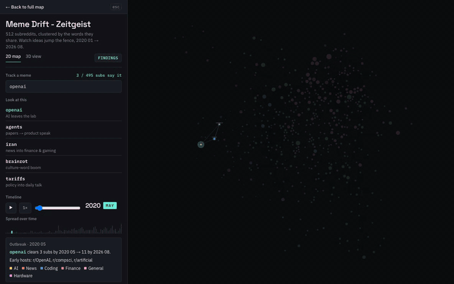
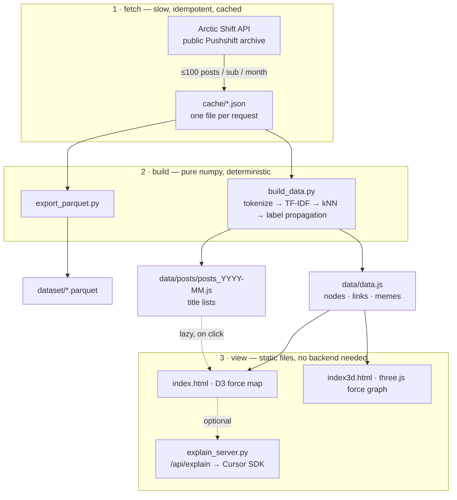

# Meme Drift — Zeitgeist

**Watch an idea jump the fence between communities.**

512 subreddits, laid out by the words they share, one snapshot per month from **Jan 2020 → Aug 2026**.
Type a word and the map shows you who said it first, who caught it next, and which line carried it across.



▶ **[Watch the full walkthrough (82s, MP4)](media/demo.mp4)** — tracking `openai` across 80 months, guided findings, a shortest path between two strangers, and a Cursor-written explanation of why that path exists.

The clip runs through, in order:

| time | what you're seeing |
|---|---|
| 0:00 | 512 subreddits, positioned only by vocabulary overlap. Nobody hardcoded "gaming goes here". |
| 0:10 | Tracking **openai**. Everything that never said it dims; the outbreak card names the early hosts — r/OpenAI, r/compsci, r/artificial, from 2020-05. |
| 0:15–0:40 | The timeline glides 2020 → 2026 at 4×. The word spreads from a single sub to a dozen, crossing out of AI into News and Finance, and the map re-knits itself every month. |
| 0:45 | **Findings** — guided paths over the live map. `claude` is a *GTA* character in 2020 and Anthropic's model in 2025: same string, two eras of meaning. |
| 1:05 | **Connect two subreddits** — two random subs, and the shortest chain of lines between them: r/AmItheAsshole · **tenant** → r/legaladvice · **clause** → r/HistoryMemes · **peasant** → r/MapPorn. |
| 1:10 | **Explain with Cursor** — the Cursor SDK reads that chain's evidence and answers *why* it exists: private conflict → legal property framing → historical territory, one bridge word per step. |

---

## The point

Memetics says ideas behave like organisms: they need hosts, they spread along contact, they mutate, they die out.
Everybody agrees the metaphor is nice. Nobody usually shows you the *host population*.

This is the host population. **Subreddits are hosts, words are the memes.** The graph is built only from what communities
actually said — no engagement metrics, no hand-drawn categories, no LLM in the pipeline. Then you press play and watch
the infection curve run across 80 months:

- `openai` starts inside r/OpenAI, spends years almost entirely in AI hosts, then gets co-hosted by Finance (r/stocks, r/StockMarket) — **the same word living in two far-apart neighbourhoods**, capability talk and market-object talk.
- `claude` records a **semantic takeover**: early on it pins to r/GTA (Claude Speed), years later the identical string sits in AI/Coding hosts.
- r/ChatGPT, r/LocalLLaMA and r/ClaudeAI **do not exist** in 2020 and pop into the map mid-timeline.

Every claim on screen is falsifiable: click a line and you get the exact word, the mention counts on both sides, and the posts behind it.

## Quick start

```bash
python3 build_data.py            # 40,960 fetches, ~hours on a cold cache; resumable and cached after
python3 -m http.server 8765      # 2D: localhost:8765   3D: localhost:8765/index3d.html
```

Pipeline deps: **Python stdlib + numpy**. No API keys, no torch. The built `data/` is committed, so you can skip
`build_data.py` entirely and just serve the repo.

Optional — the AI explain panel (needs Python 3.10+ and burns Cursor credits):

```bash
uv venv --python 3.12 /tmp/memedrift-venv && uv pip install --python /tmp/memedrift-venv/bin/python cursor-sdk
cp .env.example .env             # then put your key from cursor.com/dashboard/api in CURSOR_API_KEY
/tmp/memedrift-venv/bin/python explain_server.py     # serves the site + /api/explain on :8765
```

## Architecture



The split is the point: the network stage is the only slow or flaky part and it is fully cached, so the build is a pure
function of `cache/` that anyone can re-run and get byte-identical output. The viewer is plain static files — clone the
repo, serve it, and the map works with no Python at all.

| path | what |
|---|---|
| `build_data.py` | the whole pipeline: fetch → tokenize → TF-IDF → graph → communities → `data.js` |
| `build_partial.py` | rebuilds `data.js` from the cache alone, so the map fills in while a long fetch is still running |
| `export_parquet.py` | bulk export of posts / subreddits / links to `dataset/*.parquet` |
| `explain_server.py` | static server + `/api/explain`, backed by the Cursor SDK |
| `index.html` / `index3d.html` | the 2D and 3D maps (same data, same spring law, same proof cards) |
| `app/extras.js` | shortest-path "connect two subreddits", reset bar, first-visit tour — shared by both pages |
| `app/story.js` · `story.css` | **Findings**: guided paths that drive the live map through the existing globals |
| `app/explain.js` | the Explain panel and its API-key handling |
| `data/data.js` | the graph payload (~85 MB) |
| `data/posts/` | per-month post titles (~241 MB), fetched on demand, never on first paint |
| `monthly/` | a last-12-months mirror with its own `app/` + `data/`; shares `cache/` |

## How it works

**1 · Sample.** For each of 512 subreddits (the 480 biggest SFW subs by subscribers, plus 120 hand-picked theme seeds)
and each of 80 months, take the ≤100 most recent posts before the 1st of the following month. Title + first 1500
characters of the body. Every response is cached to `cache/`, so the pipeline is resumable and the second run is free.

**2 · Tokenize.** Lowercase word tokens of ≥3 letters (plus an allow-list of real short memes: `ai`, `gpu`, `c#`, `3d`…),
minus an 8-language stopword list, bare numbers, and relationship-post age tags like `f23`. A `(sub, month)` document
is dropped below 200 tokens — that's how dead or not-yet-existing subs stay off the map instead of faking a position.

**3 · Vectorize.** TF-IDF per `(sub, month)`: sublinear term frequency `1 + log(count)` times `log(D / (1 + df))`,
vocabulary cut at `df ≥ 3`, then L2-normalized. Normalizing means **cosine similarity is just a dot product**, so the
whole month's similarity matrix is one `M @ M.T`.

**4 · Link.** Each sub connects to its `K = 5` nearest peers that month; the union is an undirected graph. Each pair
carries its full 80-step `history`, so a line fades in and out over time instead of popping.

**5 · Attribute.** Every line names **one exact word**. Elementwise-multiply the two TF-IDF vectors and take the argmax:
that's the single term contributing most to their similarity. Alongside it we store raw mention counts on both sides,
so the claim is checkable rather than vibes. Click through and the month's post titles load on demand.

**6 · Colour.** The 12 themes are seeded with ~10 subs each; the other ~400 get their theme from **seeded label
propagation** — repeatedly adopt the heaviest theme among your neighbours, weighted by similarity, with a deterministic
tie-break, until nothing changes. Categories are emergent, not assigned.

**7 · Rank the drift.** The leaderboard scores each term by how many *new* communities carry it in their top-40
distinctive vocabulary: `subs(last month) − max(subs(first three months))`. Using distinctive words instead of raw
counts is why `actually` and `update` can't win.

**8 · Lay it out.** Each link is a spring with resting length `40 + 280 × (1 − sim / max)` px and strength
`0.1 + 0.9 × sim / max` — more shared vocabulary, shorter line. The tooltip on every line spells out the arithmetic.
The timeline is *fractional*: the layout interpolates between `floor(t)` and `ceil(t)`, so playback glides instead of
stepping. The 3D view runs the identical spring law through three.js.

**9 · Connect.** "Connect two subreddits" is Dijkstra over the month's graph with hop cost inverse to similarity,
so the chain it lights up is the strongest-vocabulary route, recomputed whenever you move the timeline.

**10 · Explain.** The Explain panel ships the selection's evidence (themes, signatures, bridge words, mention counts,
snapshot) as JSON to `/api/explain`, which runs the Cursor SDK in an **empty temp working directory** — the agent can't
touch this repo, and it's instructed to answer only from the supplied evidence and never to claim causation.
The LLM is a narrator over the graph, never an input to it.

## Data payload

`window.DATA` in `data/data.js` — 512 nodes, 21,417 pairs, 80 snapshots:

| field | shape | what |
|---|---|---|
| `snapshots` | `["2020-01", … "2026-08"]` | the 80 month labels |
| `nodes[]` | `{id, cat, subs, terms, use}` | `terms` = top 40 TF-IDF words per month with weights; `use` = top 60 raw counts, so ubiquitous words stay searchable |
| `links[]` | `{source, target, history, shared, proof}` | `history` = 80 similarities (0 = absent that month), `shared` = top 5 shared words, `proof` = mention counts on each side |
| `categories[]` | `{id, name, words, size}` | emergent themes with their three most characteristic words |
| `memes[]` | `{term, spread}` | leaderboard terms with subs-per-month curves |

Post titles are *not* in this payload. They live in `data/posts/posts_YYYY-MM.js` and load only when you ask for the
receipts behind a keyword.

## Bulk dataset (Parquet)

```bash
python3 export_parquet.py     # after build_data.py; needs pyarrow
```

| file | what |
|---|---|
| `posts.parquet` | one row per sampled post: `subreddit, theme, snapshot, post_id, created_utc, author, score, num_comments, title, selftext, flair, url, over_18, permalink` |
| `subreddits.parquet` | `subreddit, theme, subscribers`, plus per-snapshot top words |
| `links.parquet` | one row per (pair, snapshot): `source, target, snapshot, cosine_similarity, keyword, shared_words, keyword_mentions_source/target` |

zstd-compressed; open with pandas, duckdb, or polars. Every post keeps its Reddit permalink, so anything visible on the
map traces back to the original thread.
Source: [Arctic Shift](https://arctic-shift.photon-reddit.com), the public Pushshift successor.

## Knobs

- `TOP_N` / `THEMES` in `build_data.py` — how many big subs to pull, and the seed subs per theme.
- `SNAPSHOTS` — `python3 build_data.py` builds all 80 months; `python3 build_data.py monthly` builds just the last 12 into `monthly/`.
- `K = 5` — neighbours per node per month; raise for a denser web.
- `CURSOR_MODEL` in `.env` — which model answers the *why* questions (default `composer-2.5`).

## What this does not claim

Co-occurrence is association, not transmission. A shared bridge word means two communities were oriented toward the
same framing that month — it does not prove one infected the other. Sampling is ≤100 posts per sub per month, which
catches vocabulary trends but not volume. Titles and lead paragraphs only; comments are out of scope. The map is
honest about all three: every edge shows you its word and its counts, and you can go read the posts.
